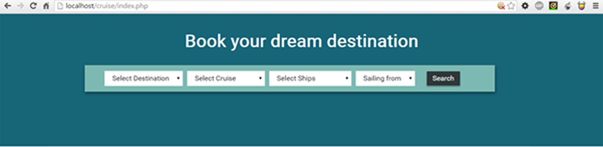
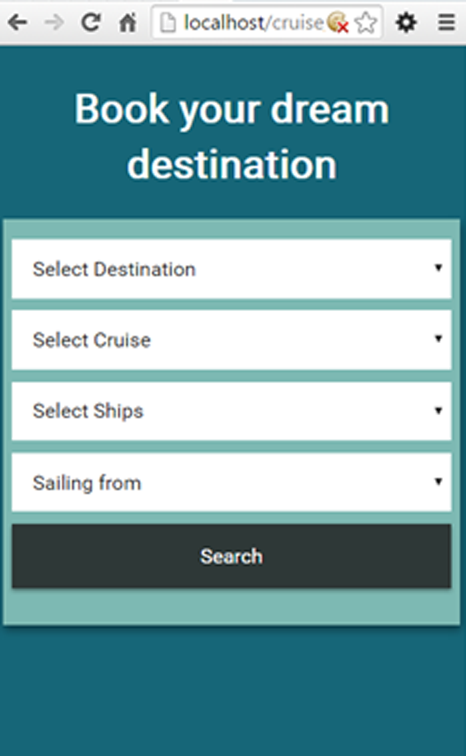

# Cruise Web Application

This web application displays bookings data examples based on what the user is searching for. The nav itself is being displayed from the databse, which then takes whatever the user has selected and finds the matching results and therefore displays that on the screen. 

The programing language use here are **PHP, CSS/SASS, jQuery**

This is a desktop view 
 

 This is a mobile and tablet view

